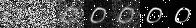
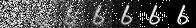
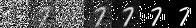

(Simplified) diffusion model implementation based on the [DDPM](https://arxiv.org/abs/2006.11239) paper.  Implementation is based on the [hugging face annotated diffusion blog](https://huggingface.co/blog/annotated-diffusion) .

The model is trained on the [MNIST](https://www.kaggle.com/datasets/hojjatk/mnist-dataset) digits dataset. I will make a deeper model and try it with a more complex dataset later.

To run a trained model locally,  download the repo and run the following. This will run the model with trained weights (that I trained on my local CPU only machine in 1hr) & produce one sample.

    python3 -m venv . 
    pip3 install -r requirements.txt
    cd src/main
    python3 test.py
 
 To train the model, you can run `python3 main.py` inside the `src/main` directory. The trained weights will be stored in the same directory. You can change `test.py` 
to infer with the new weights.

Some sample inference examples from my local machine.

